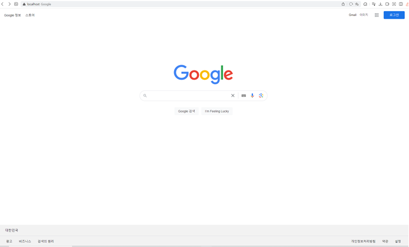
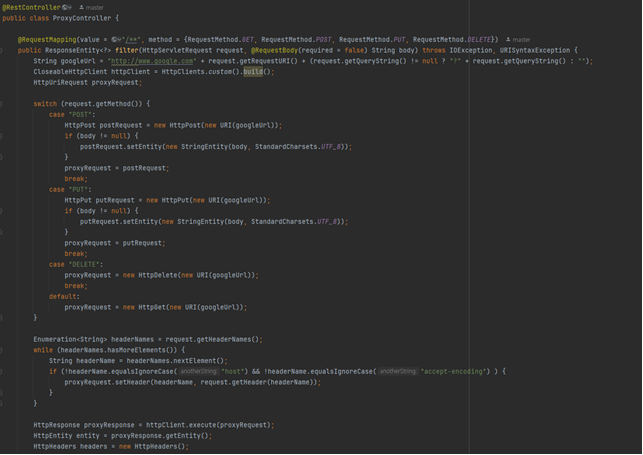
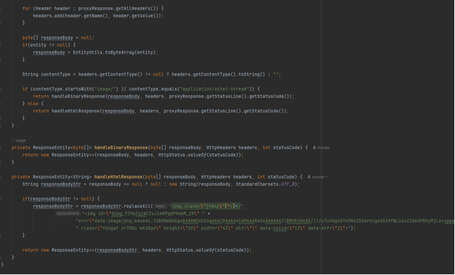
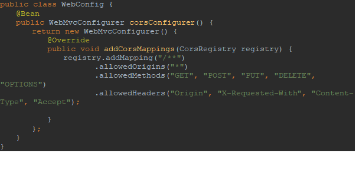
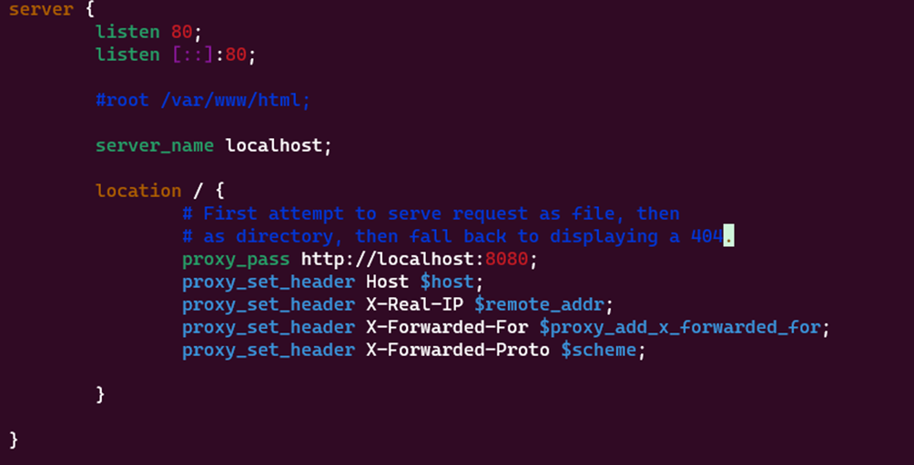
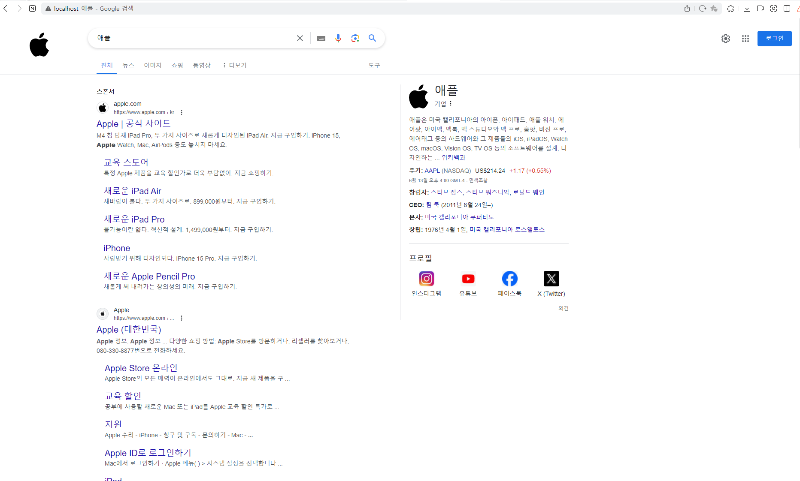

## 리버스 프록시 서버를 활용한 HTML 수정 ##
### 구글 검색 페이지 로고 변경하기 ### 

개발한 프로젝트를 VM에 배포할 때 NginX와 같은 웹서버를 많이 활용합니다.  
NginX는 웹서버의 전통적인 역할인 정적파일을 응답하는 역할도 하지만 리버시 프록스 서버의 역할도 수행할 수 있습니다.  
리버스 프록시란 네트워크 내부에서 외부로 나가는 통신과정에서 네트워크 내부와 외부 인터넷 사이에 중계자 역할을 하는 정방향 프록시 서버의 역방향 개념입니다.  
외부에서 내부로 들어오는 통신과정에서 중간에서 중계자 역할을 한다고 해서 리버스 프록시 서버라고 합니다.  

지금도 운영하고 있는 수 많은 웹 프로젝트들에서도 리버시 프록스 서버를 활용해 로드 밸런싱,SSL 인증, 무중단 배포등의 다양한 일들을 처리하고 있습니다.  
이 글에서는 대표적인 리버스 프록시 서버 중 하나인 Nginx를 활용해 Google 웹사이트와 클라이언트 사이에서 HTML을 수정해 구글로고를 애플로고로 변경해 클라이언트에 반환하는 기능을 구현해 보도록하겠습니다.  


#### 개발환경 ####
> OS : Window 10  
> VM : Docker Desktop Ubuntu   
> Server Framework : Spring Boot 3.X  
> Language : Java 17

<h3>1단계</h3>

우선 reverse proxy 환경구성을 위해 nginx 를 설치합니다.  
설치한 다음, nginx가 정상적으로 설치된지 확인하고 실행한 뒤, 정상적으로 프로세스가 동작하고 있는지 확인합니다.  

그 다음, nginx 서버를 실행시키고 localhost 주소를 입력하면 http://www.google.com으로 포트포워딩하기 위해 설치한 NginX가 설치된 폴더에 nginx.conf 파일을 수정하였습니다.  
nginx.conf 파일의 중간 부분에 server 블록의 내용을 아래와 같이 수정해 http://localhost 를 주소창에 입력하면http://google.com 으로 리다이렉트하도록 설정해주었습니다.  

```bash
server {
    listen 80;
    listen [::]:80;
    server_name localhost;

    location / {
      proxy_pass http://www.google.com;
    }
}
```

listen 부분의 숫자는 외부에서 서버(여기서는 서버역할을 하는 내 컴퓨터)에 요청이 들어왔을 때 Nginx가 담당하는 포트번호를 의미합니다.  
외부에서 80 포트로 요청이 들어오면 Nginx가 처리한다는 의미입니다.  
아래의 [::]:80은 Ipv6 형태를 의미합니다.  
80 포트는 Http의 기본 포트로, 우리가 구현할 기능은 구글 웹사이트의 로고를 변경하는 기능이기 때문에 80포트로 지정해주었습니다.

80포트로 요청이 들어오면 요청 URL에 따라 처리할 location 블록을 찾습니다.
위 코드에서는 location 옆에 '/' 만 존재하므로 http://localhost 를 브라우저 주소창에 입력하면 http://www.google.com 으로 요청을 전달합니다.  
Http 기본 포트인 80 포트는 생략이 가능하기때문에 뒤에 포트번호를 생략할 수 있습니다.  

이제, 변경사항을 저장하고 Nginx 서버를 실행시킵니다.
그 다음 브라우저 주소창에 http://localhost 를 입력하면 구글 홈페이지로 이동하는 것을 확인할 수 있습니다.  



여기서 검색이나 로그인 같은 다른 기능들도 모두 정상적으로 동작합니다.  
왜냐하면, 지금 우리가 구현한 리버스 프록시 서버로 요청이 들어오면 그대로 구글 웹사이트로 위임하기 때문에 실질적으로 처리하는 작업이 없기 때문입니다.


<h3>2단계</h3>

검색결과 페이지의 로고를 변경하기 위해서는 아래와 같은 부분을 고려해야합니다.

> - GET 요청을 통해 전달받은 HTML 문서를 편집할 수 있어야함

HTML을 편집하기 위해서는 1단계에서처럼 www.google.com 으로 직접적으로 redirect 하지 않고 클라이언트와 google.com 사이에 프로그램을 두고 필터링 작업을 처리하고, 처리결과를 클라이언트에 전달하는 중간계층이 필요합니다.  
NginX에서 location 블록에 sub_filter 를 통해 간단한 작업을 처리할 수 있지만, 프로그램의 요구사항이 복잡해질수록 유지보수하기 어렵고 한계가 있으므로 필터프로그램을 작성하는 것이 더 적합하고, 문제의 요구사항에도 부합합니다.      

그래서 Spring Boot 프로젝트를 만들어 google.com과 클라이언트 사이에서 클라이언트의 요청을 전달하고 서버의 응답을 필터링해 클라이언트에게 반환하는 프로그램을 구현하겠습니다.  
반드시 Spring Boot 프로젝트를 이용할 필요는 없고 Http Request를 처리하고 클라이언트에 Response를 전달할 수만 있으면 됩니다.

HTTP 요청이 왔을 때, 헤더정보와 body 정보를 복사해서 www.google.com 에 요청을 보내고, 응답결과의 response body를 수정해서 구글로고 이미지를 교체하는 작업을 수행할 코드를 작성하겠습니다.

##### ProxyController #####



##### WebConfig #####


코드의 동작과정은 아래와 같습니다.  

> 1.	클라이언트가 요청한 url 과 검색기능을 위해 queryString을 조합해 url을 완성합니다.
> 2.	실제 google 웹사이트에 요청을 전송하기 위해 프록시 요청 객체를 Http method에 따라 설정하고 request body가 존재하는 경우 프록시 요청객체에도 동일한 request body를 설정해줍니다.
> 3.	헤더 정보도 클라이언트의 request header로부터 복사해 동일하게 설정합니다. 이 때, google 웹사이트와 충돌을 피하기 위해 host 헤더는 복사하지 않습니다. 또한 google.com에서 응답한 데이터가 gzip, deflate, br, zstd등 압축파일인 경우 디코딩이 어려워 정상적으로 페이지가 로딩되지 않아 프로젝트 기능 요구사항에 필요한 text/html 과 image에 집중하기위해 accept-encoding 헤더 또한 헤더에 포함시키지 않았습니다. 
> 4.	완성된 proxyRequest 객체를 google.com 서버에 전송하여 proxyResponse를 얻을 수 있습니다.
> 5.	proxyResponse에 설정된 header정보와 responseBody를 복사하여 응답 response에 필요한 구성요소들을 만들어줍니다. 이 때, 이미지파일과 html 텍스트 타입의 처리를 분리하기 위해 proxyResponse의 응답 entity를 바로 문자열로 변환하지 않고 byte[] 형태로 변환합니다.
> 6.	변환한 byte[]를 content-type에 따라 구분하여 처리합니다. Content-type이 이미지타입이 아닌경우, String 형태로 변환한 html 코드에서 로고에 해당하는 이미지를 교체해 줍니다.
      6-1. 프록시 서버를 통해 클라이언트의 요청을 위임하는 구조를 가졌기 때문에, 이미지를 요청하는 localhost와 실제 구글로고 이미지의 소유권을 가진 google.com의 도메인이 달라 CORS 위반 오류가 발생할 수 있어 모든 Origin에 대해 허용해주었습니다.

이제 프로젝트를 로컬환경에서 실행한 다음 NginX에서 클라이언트가 localhost로 접속하면 동작중인 필터 프로그램으로 포트포워딩하도록 설정해주었습니다



기존의 내용과 비교해 location 블록의 내용이 변경되었습니다.  
요청이 들어왔을 때 전달하는 URL이 www.google.com 에서 구현한 SpringBoot 프로젝트로 변경되었습니다.  
아래의 내용들은 http://localhost:8080 서버에 클라이언트의 Host 정보, IP 정보, IP 식별정보, 프로토콜 정보를 헤더에 포함시키겠다는 내용입니다.  

변경사항을 저장하고 재시작한 다음 웹 브라우저에 주소를 입력하고 로고가 교체되었는지 확인해보았습니다.



왼쪽 상단 구글로고가 있어야할 자리에 애플로고가 들어가 있습니다.
이번 글에서는 이미지만 교체했지만, 응용하면 다양한 분야에 활용할 수 있습니다.  
무분별한 클라이언트의 요청에 대한 보안 처리를 할 수도있고, 클라이언트에 따라 다른 내용을 보여줄 수도 있습니다.  
또한 불법적인 접근에 대해서 요청을 거절하는 등 중계자로써 다양한 역할을 수행할 수 잇습니다.


